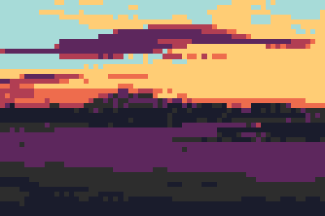

# SwiftPixelIt

A Swift library for converting images into pixel art, inspired by the JavaScript pixelit library. Built with Core Graphics for high performance on iOS and macOS.

## Sample Results

| Original | Pixelated | With Palette |
|----------|-----------|--------------|
|  |  |  |

*Original photo by [Alex Panarin](https://unsplash.com/@alex_panarin) on [Unsplash](https://unsplash.com)*

## Features

- Convert images to pixel art with configurable pixelation levels
- Apply custom color palettes to images
- Convert images to grayscale
- Support for both iOS and macOS
- Fluent API design with method chaining
- High performance using Core Graphics

## Installation

### Swift Package Manager

Add the following to your `Package.swift` file:

```swift
dependencies: [
    .package(url: "https://github.com/takumatt/swift-pixelit.git", from: "1.0.0")
]
```

Or add it through Xcode:
1. File → Add Package Dependencies
2. Enter the repository URL: `https://github.com/takumatt/swift-pixelit.git`

## Usage

### Basic Pixelation

```swift
import SwiftPixelIt

let processor = PixelArtProcessor()
let pixelatedImage = processor.pixelate(yourImage)
```

### Custom Configuration

```swift
let configuration = PixelArtConfiguration(
    pixelSize: 12,
    maxSize: CGSize(width: 300, height: 300)
)

let pixelatedImage = processor.pixelate(yourImage, using: configuration)
```

### Apply Color Palette

```swift
let processor = PixelArtProcessor()

// Use built-in palettes
let retroImage = processor.applyPalette(yourImage, palette: .retro)
let gameboyImage = processor.applyPalette(yourImage, palette: .gameboy)

// Create custom palette
let customPalette = ColorPalette(colors: [
    Color(red: 255, green: 0, blue: 0),
    Color(red: 0, green: 255, blue: 0),
    Color(red: 0, green: 0, blue: 255)
])
let customImage = processor.applyPalette(yourImage, palette: customPalette)
```

### Grayscale Conversion

```swift
let processor = PixelArtProcessor()
let grayscaleImage = processor.convertToGrayscale(yourImage)
```

### Complete Pixel Art Processing

```swift
let configuration = PixelArtConfiguration(
    pixelSize: 8,
    maxSize: CGSize(width: 400, height: 400),
    colorPalette: .retro
)

let processor = PixelArtProcessor()
let pixelArt = processor.processPixelArt(yourImage, configuration: configuration)
```

## API Reference

### PixelArtProcessor

The main processor for creating pixel art effects.

#### Processing Methods
- `pixelate(_ image: PlatformImage, using configuration: PixelArtConfiguration = .default) -> PlatformImage?`
- `applyPalette(_ image: PlatformImage, palette: ColorPalette) -> PlatformImage?`
- `convertToGrayscale(_ image: PlatformImage) -> PlatformImage?`
- `processPixelArt(_ image: PlatformImage, configuration: PixelArtConfiguration) -> PlatformImage?`

### PixelArtConfiguration

Configuration struct for pixel art processing.

```swift
let config = PixelArtConfiguration(
    pixelSize: 8,                              // Size of pixels (1-50)
    maxSize: CGSize(width: 400, height: 400),  // Optional max dimensions
    colorPalette: .retro                       // Optional color palette
)
```

### ColorPalette

Defines color palettes for pixel art.

```swift
// Built-in palettes
let retro = ColorPalette.retro
let gameboy = ColorPalette.gameboy

// Custom palette with Color objects
let customPalette = ColorPalette(colors: [
    Color(red: 255, green: 0, blue: 0),
    Color(red: 0, green: 255, blue: 0),
    Color(red: 0, green: 0, blue: 255)
])

// Custom palette from RGB arrays
let rgbPalette = ColorPalette(rgbColors: [
    [255, 0, 0],
    [0, 255, 0], 
    [0, 0, 255]
])
```

### Color

Type-safe color representation.

```swift
let color = Color(red: 255, green: 128, blue: 0)  // Values are clamped to 0-255
```

## Platform Support

- iOS 13.0+
- macOS 10.15+

## License

MIT License - see LICENSE file for details.